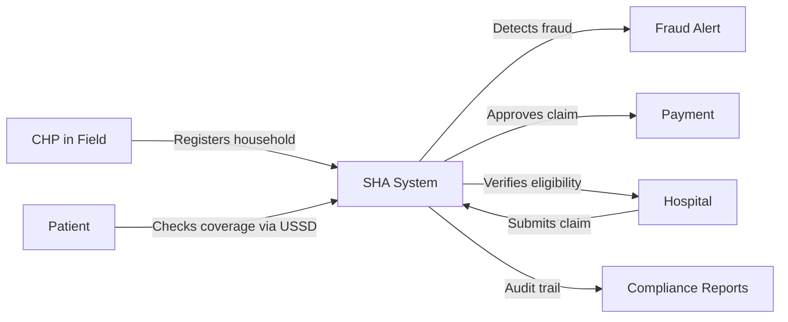

# SHA Verification System — API & System Documentation

> Kenya's national health insurance management platform for the Social Health Authority (SHA)

**Developer:** Christopher Mugambi | University of Nairobi
**Contact:** ceewalker12@gmail.com
**Version:** 1.0.0

---

## Quick Navigation

### System Information
| Document | Description |
|----------|-------------|
| [System Overview](docs/system-overview.md) | Architecture, tech stack, capabilities, use cases |
| [Technical Specifications](docs/technical/specifications.md) | Performance, security, compliance, deployment options |
| [Business Information](docs/business/business-info.md) | Value proposition, pricing, ROI calculator |

### API Reference
| Module | Base Path | Description |
|--------|-----------|-------------|
| [Authentication](endpoints/auth.md) | `/api/auth` | Login, register, JWT token management |
| [Members](endpoints/members.md) | `/api/members` | Member registration & eligibility |
| [Claims](endpoints/claims.md) | `/api/claims` | Claims submission & processing |
| [Hospitals](endpoints/hospitals.md) | `/api/hospitals` | Hospital management & verification |
| [Fraud Detection](endpoints/fraud.md) | `/api/fraud` | Risk assessment & fraud alerts |

### Workflows (with Diagrams)
| Workflow | Description |
|----------|-------------|
| [CHP Workflow](workflows/chp-workflow.md) | Community health promoter end-to-end flow |
| [Claims Workflow](workflows/claims-workflow.md) | Full claim lifecycle from submission to payment |
| [Fraud Workflow](workflows/fraud-workflow.md) | Fraud detection and investigation process |

### Guides
| Guide | Description |
|-------|-------------|
| [Quick Start](docs/guides/quickstart.md) | Running in 5 minutes + code examples (Python, JS, PHP, cURL) |

### Enterprise & Security
| Document | Description |
|----------|-------------|
| [Security Documentation](docs/security/security.md) | Architecture, encryption, RBAC, compliance |
| [Enterprise Features](docs/enterprise/enterprise-features.md) | Scaling, HA, disaster recovery, SLAs, support tiers |

### Legal & Compliance
| Document | Description |
|----------|-------------|
| [Legal Documentation](docs/legal/legal.md) | Terms of service, privacy policy, license, DPA, SLA |

### Marketing & Roadmap
| Document | Description |
|----------|-------------|
| [Case Studies & Roadmap](docs/marketing/case-studies.md) | Use cases, demo info, Postman collection, roadmap, partner program |

---

## What This System Does



- **Members:** Register, search, verify eligibility
- **Claims:** Submit, score risk, approve/reject, track
- **Hospitals:** Register, verify, monitor performance
- **Fraud:** Auto-detect, alert, investigate, resolve
- **USSD:** Mobile access via *123# — no smartphone needed
- **AI/ML:** Fraud scoring, explainable AI, network analysis

---

## 5-Minute Quick Start

```bash
# 1. Install
pip install -r requirements.txt

# 2. Setup
python setup_system.py

# 3. Run
python main_app.py

# 4. Login
curl -X POST http://localhost:5000/api/auth/login \
  -H "Content-Type: application/json" \
  -d '{"username":"admin","password":"YOUR_PASSWORD"}'

# 5. Use the token
curl http://localhost:5000/api/members \
  -H "Authorization: Bearer YOUR_TOKEN"
```

Full guide → [Quick Start](docs/guides/quickstart.md)

---

## Base URL

```
http://localhost:5000        # Development
https://your-domain.com     # Production
```

All API endpoints require:
```http
Authorization: Bearer <jwt_token>
```

Except `POST /api/auth/login` and `POST /api/auth/register`.

---

## License

Proprietary — Christopher Mugambi © 2024–2025. See [Legal Documentation](docs/legal/legal.md) for full terms.
For licensing inquiries: ceewalker12@gmail.com
