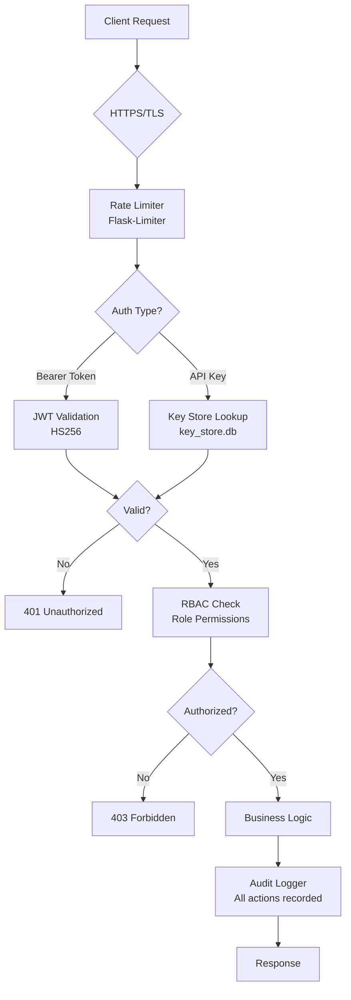

# Security Documentation

---

## Security Architecture



---

## Data Protection

### Encryption at Rest
- Sensitive data fields encrypted with **Fernet** (AES-128-CBC + HMAC-SHA256)
- Database backups encrypted with AES before storage
- API keys stored hashed, never in plaintext
- Passwords hashed with **PBKDF2-HMAC-SHA256** + unique salt

### Encryption in Transit
- All production traffic over **HTTPS/TLS 1.2+**
- JWT tokens signed with **HS256**
- API keys transmitted only over HTTPS

### Data Minimization
- Only necessary fields collected per endpoint
- PII fields clearly identified in data models
- Soft-delete pattern — records deactivated, not immediately purged

---

## Access Control

### Role Hierarchy

```
admin
  └── claims_officer
  └── hospital_admin
        └── doctor
  └── chp
  └── auditor (read-only)
```

### Permission Matrix

| Action | admin | claims_officer | hospital_admin | doctor | chp | auditor |
|--------|-------|---------------|----------------|--------|-----|---------|
| Manage users | ✅ | ❌ | ❌ | ❌ | ❌ | ❌ |
| Approve claims | ✅ | ✅ | ❌ | ❌ | ❌ | ❌ |
| Submit claims | ✅ | ✅ | ✅ | ❌ | ❌ | ❌ |
| Register members | ✅ | ✅ | ✅ | ✅ | ✅ | ❌ |
| View audit logs | ✅ | ❌ | ❌ | ❌ | ❌ | ✅ |
| Fraud alerts | ✅ | ✅ | ❌ | ❌ | ❌ | ✅ |
| Verify hospitals | ✅ | ❌ | ❌ | ❌ | ❌ | ❌ |

---

## Audit Trails

Every action in the system is logged with:

```json
{
  "timestamp": "2024-06-01T09:15:00Z",
  "user_id": 5,
  "username": "claims_officer_01",
  "role": "claims_officer",
  "action": "approve_claim",
  "resource": "claims",
  "resource_id": 56,
  "ip_address": "192.168.1.100",
  "result": "success"
}
```

Audit logs are:
- Immutable — cannot be edited or deleted by regular users
- Exported via `POST /api/audit/export`
- Shipped to Loki for centralized monitoring
- Retained per data retention policy (default: 7 years for health records)

---

## API Key Security

```bash
# Generate a new API key
python api_keys/key_manager.py create --user-id 1 --key-name "Hospital Integration" --created-by 1

# List all active keys
python api_keys/key_manager.py list

# Revoke a compromised key immediately
python api_keys/key_manager.py revoke --key-id 3 --created-by 1
```

- Keys stored in a **separate database** (`key_store.db`) isolated from main data
- Keys are hashed — even admins cannot retrieve the original key after creation
- Keys can be scoped to specific IP ranges (enterprise feature)
- Automatic expiry configurable per key

---

## Compliance Reports

### Kenya Data Protection Act 2019
- Data controller registration recommended
- Consent captured at member registration
- Data subject rights (access, correction, deletion) supported via API
- Cross-border transfer controls in place

### HIPAA Alignment
| Requirement | Implementation |
|-------------|---------------|
| Access controls | RBAC + JWT |
| Audit controls | Full audit trail |
| Integrity controls | Fernet encryption |
| Transmission security | HTTPS/TLS |
| Minimum necessary | Role-scoped data access |

### GDPR Principles
| Principle | Implementation |
|-----------|---------------|
| Lawfulness | Consent at registration |
| Data minimization | Only required fields collected |
| Accuracy | Update endpoints available |
| Storage limitation | Configurable retention policies |
| Right to erasure | Member deletion endpoint |
| Security | Encryption + access control |
