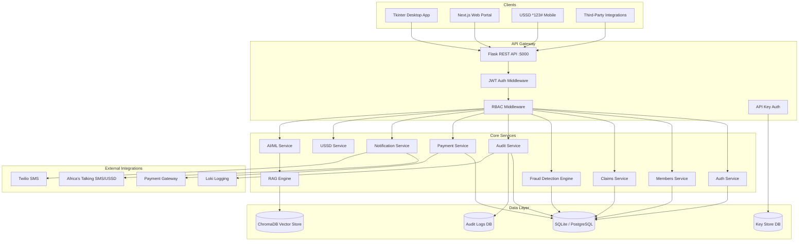

# System Overview

**SHA Verification System** — Kenya's national health insurance management platform built for the Social Health Authority (SHA).

Developed by: Christopher Mugambi | University of Nairobi
Contact: ceewalker12@gmail.com

---

## Architecture Diagram

---

## Technology Stack

### Backend
| Technology | Version | Purpose |
|------------|---------|---------|
| Python | 3.8+ | Core language |
| Flask | 2.0+ | REST API framework |
| Flask-CORS | 3.0+ | Cross-origin requests |
| Flask-Limiter | 3.0+ | Rate limiting |
| PyJWT | 2.8+ | JWT token auth |
| bcrypt | 4.0+ | Password hashing |
| cryptography | 41.0+ | Fernet data encryption |
| SQLite3 | Built-in | Development database |
| PostgreSQL (psycopg2) | 2.9+ | Production database |
| Waitress | 3.0+ | Windows WSGI server |

### AI / Machine Learning
| Technology | Purpose |
|------------|---------|
| scikit-learn | ML fraud detection models |
| numpy / pandas | Data processing |
| scipy | Statistical analysis |
| statsmodels | Advanced statistics |
| SHAP | Model explainability (XAI) |
| LIME | Local model interpretability |
| sentence-transformers | NLP embeddings |
| ChromaDB | Vector store for RAG |
| networkx | Network/graph fraud analysis |

### Frontend
| Technology | Purpose |
|------------|---------|
| Tkinter | Desktop application (Python built-in) |
| Next.js | Web portal |
| TypeScript | Web frontend language |
| Tailwind CSS | Web UI styling |

### Integrations
| Service | Purpose |
|---------|---------|
| Africa's Talking | SMS & USSD gateway |
| Twilio | SMS fallback |
| APScheduler | Background job scheduling |
| Loki | Centralized log aggregation |
| geopy | Geospatial analysis |
| reportlab / fpdf2 | PDF report generation |

---

## System Capabilities

### Member Management
- Register SHA members with full demographic data
- Search by name, national ID, phone
- Check real-time eligibility at point of care
- Manage member status (active, suspended, inactive)
- Bulk import and export

### Claims Processing
- Submit health claims from hospitals
- Automatic duplicate detection
- Real-time risk scoring (0–100)
- Approve, reject, and track claims
- Claims statistics and reporting

### Fraud Detection
- AI/ML-powered fraud scoring
- 10-point fraud detection engine
- Network analysis for collusion detection
- Geospatial anomaly detection
- Automatic high-risk alerts
- SHA-specific fraud typology detection

### Hospital Management
- Register and verify healthcare facilities
- Track per-hospital performance metrics
- Approval rate and risk score monitoring
- Facility code management (KMHFL-aligned)

### Authentication & Security
- JWT-based stateless authentication
- Role-based access control (RBAC)
- API key management for integrations
- Password hashing with PBKDF2 + salt
- Fernet encryption for sensitive data
- Full audit trail of all actions

### USSD Integration
- Mobile access via *123# shortcode
- Africa's Talking gateway integration
- Member verification via feature phone
- Works without internet (USSD protocol)

### AI & Intelligence
- RAG (Retrieval-Augmented Generation) engine
- NLP intelligence for document analysis
- Explainable AI (XAI) with SHAP/LIME
- Predictive analytics for fraud patterns
- Data science dashboard

### Reporting & Compliance
- PDF report generation
- Audit log export
- Real-time dashboards
- Loki-integrated centralized logging

---

## Use Cases

### Government Health Authority
- National member enrollment tracking
- Claims adjudication at scale
- Fraud prevention across all facilities
- Compliance reporting to regulators

### Hospitals & Clinics
- Verify patient eligibility before treatment
- Submit and track claims digitally
- Reduce claim rejection rates
- Real-time payment status

### Community Health Promoters (CHPs)
- Register households in the field
- Conduct means testing assessments
- Log visits and referrals
- Offline-capable with sync

### Insurance Administrators
- Monitor claims pipeline
- Investigate fraud alerts
- Generate financial reports
- Manage hospital network

### Patients / Members
- Check coverage via USSD (*123#)
- No smartphone required
- Works on any mobile network in Kenya

---

## Target Industries

| Industry | Application |
|----------|-------------|
| Government Health Insurance | Primary use case — SHA Kenya |
| Private Health Insurance | Adaptable for private insurers |
| Hospital Networks | Multi-facility claims management |
| NGO Health Programs | Community health tracking |
| Microfinance / SACCO Health | Member benefit management |
| County Health Departments | Sub-national health data |
