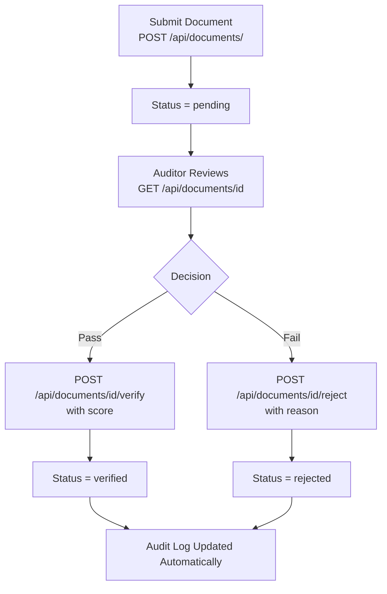

# Document Verification API

**Base Path:** `/api/documents`
**Target:** Government agencies, healthcare providers, educational institutions

---

## Overview

Validates and verifies official documents with scoring, status tracking, and full audit trails. Supports national IDs, medical certificates, academic credentials, and any structured document type.

**Key Features:**
- Document validation with verification scoring
- Multi-document-type support
- Full audit trail on every verification action
- Reject workflow with reason tracking
- File attachment support per document

---

## Endpoints

### List Documents
```
GET /api/documents/
```
**Required Role:** `admin`, `auditor`, `user`

**Query Parameters:**
| Parameter | Description |
|-----------|-------------|
| `document_type` | Filter by type (e.g. `national_id`, `certificate`) |
| `status` | `pending`, `verified`, `rejected` |
| `document_number` | Search by document number |
| `full_name` | Search by owner name |

**Response `200`:**
```json
{
  "success": true,
  "documents": [
    {
      "id": 1,
      "document_type": "national_id",
      "document_number": "12345678",
      "full_name": "Jane Wanjiku",
      "status": "verified",
      "verification_score": 95
    }
  ],
  "count": 1
}
```

---

### Get Single Document
```
GET /api/documents/<id>
```
**Required Role:** `admin`, `auditor`, `user`

Returns document details including attached files and full verification log history.

**Response `200`:**
```json
{
  "success": true,
  "document": {
    "id": 1,
    "document_type": "national_id",
    "document_number": "12345678",
    "full_name": "Jane Wanjiku",
    "status": "verified",
    "verification_score": 95,
    "files": [],
    "verification_logs": []
  }
}
```

---

### Create Document
```
POST /api/documents/
```
**Required Role:** `admin`, `user`

**Request Body:**
```json
{
  "document_type": "national_id",
  "document_number": "12345678",
  "full_name": "Jane Wanjiku",
  "created_by": 1,
  "date_of_birth": "1990-05-15",
  "issuing_authority": "IPRS Kenya"
}
```

**Required Fields:** `document_type`, `document_number`, `full_name`, `created_by`

**Response `201`:**
```json
{
  "success": true,
  "message": "Document created successfully",
  "document_id": 42
}
```

---

### Verify Document
```
POST /api/documents/<id>/verify
```
**Required Role:** `admin`, `auditor`

**Request Body:**
```json
{
  "user_id": 5,
  "verification_score": 95
}
```

**Response `200`:**
```json
{
  "success": true,
  "message": "Document verified successfully"
}
```

---

### Reject Document
```
POST /api/documents/<id>/reject
```
**Required Role:** `admin`, `auditor`

**Request Body:**
```json
{
  "user_id": 5,
  "reason": "Document appears tampered — serial number inconsistent"
}
```

**Response `200`:**
```json
{
  "success": true,
  "message": "Document rejected successfully"
}
```

---

### Document Statistics
```
GET /api/documents/stats
```
**Required Role:** `admin`, `auditor`

**Response `200`:**
```json
{
  "success": true,
  "stats": {
    "pending": 12,
    "verified": 340,
    "rejected": 18,
    "total": 370
  }
}
```

---

### Add File to Document
```
POST /api/documents/<id>/files
```
**Required Role:** `admin`, `user`

Attach a scanned file or image to a document record.

---

## Verification Score Guide

| Score | Meaning |
|-------|---------|
| 90–100 | High confidence — auto-verify eligible |
| 70–89 | Good — manual review recommended |
| 50–69 | Moderate — requires additional checks |
| 0–49 | Low confidence — likely reject |

---

## Workflow



---

## Use Cases
- Government ID verification at service points
- Hospital patient identity confirmation
- University credential verification
- Insurance document validation
- KYC (Know Your Customer) for financial services
