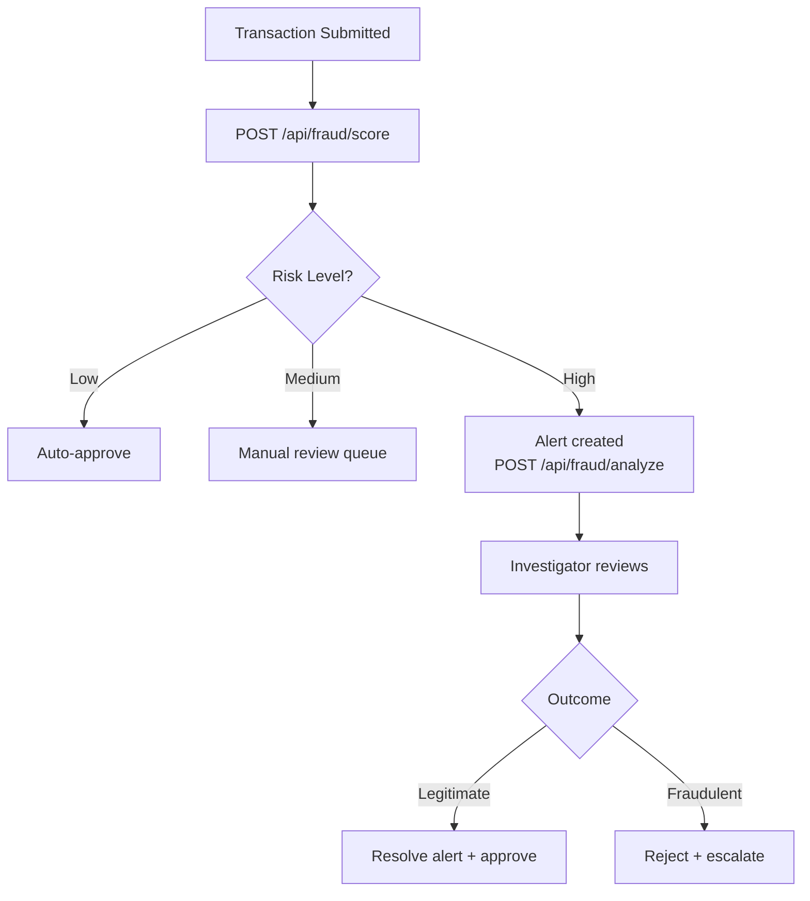

# Fraud Detection API

**Base Path:** `/api/fraud`
**Target:** Insurance companies, banks, healthcare providers

---

## Overview

AI/ML-powered fraud detection with real-time risk scoring, high-risk alerts, and investigation workflows. Built with a 10-point fraud detection engine, network analysis for collusion detection, and SHA-specific fraud typologies.

**Key Features:**
- AI/ML fraud scoring (0–100 risk scale)
- Real-time risk assessment on submission
- High-risk alert generation and management
- Network graph analysis for coordinated fraud
- Explainable AI (SHAP/LIME) — know *why* a score was given
- Geospatial anomaly detection

---

## Endpoints

### Analyze Transaction
```
POST /api/fraud/analyze
```
**Required Role:** `admin`, `auditor`

Runs full fraud analysis on a transaction or claim.

**Request Body:**
```json
{
  "transaction_id": 55,
  "transaction_type": "claim",
  "amount": 150000,
  "member_id": 1,
  "provider_id": 3,
  "metadata": {
    "treatment_type": "Inpatient",
    "admission_date": "2024-06-01"
  }
}
```

**Response `200`:**
```json
{
  "success": true,
  "transaction_id": 55,
  "risk_score": 87,
  "risk_level": "high",
  "fraud_indicators": [
    "Amount exceeds 3x average for treatment type",
    "Provider has elevated rejection rate",
    "Duplicate pattern detected in last 30 days"
  ],
  "recommendation": "Reject",
  "explanation": {
    "top_factors": ["amount_anomaly", "provider_risk", "duplicate_pattern"]
  }
}
```

---

### Score Transaction
```
POST /api/fraud/score
```
**Required Role:** `admin`, `auditor`, `claims_officer`

Lightweight scoring — returns score only, no full analysis.

**Request Body:**
```json
{
  "type": "claim",
  "id": 55
}
```

**Response `200`:**
```json
{
  "type": "claim",
  "id": 55,
  "risk_score": 87,
  "risk_level": "high",
  "recommendation": "Reject"
}
```

---

### Get Fraud Reports
```
GET /api/fraud/reports
```
**Required Role:** `admin`, `auditor`

**Query Parameters:**
| Parameter | Description |
|-----------|-------------|
| `status` | `active`, `resolved` |
| `severity` | `low`, `medium`, `high` |
| `page` | Page number |
| `per_page` | Results per page |

**Response `200`:**
```json
{
  "alerts": [
    {
      "id": 7,
      "alert_type": "High Risk Claim",
      "description": "Risk score 87 detected for claim ID 55",
      "severity": "high",
      "status": "active",
      "created_at": "2024-06-01T09:20:00Z"
    }
  ],
  "total": 1
}
```

---

### Get High-Risk Activities
```
GET /api/fraud/high-risk
```
**Required Role:** `admin`, `auditor`

**Query Parameters:**
| Parameter | Default | Description |
|-----------|---------|-------------|
| `threshold` | `50` | Minimum risk score |

**Response `200`:**
```json
{
  "claims": [...],
  "count": 23
}
```

---

### Resolve Alert
```
POST /api/fraud/alerts/<id>/resolve
```
**Required Role:** `admin`, `auditor`

**Request Body:**
```json
{
  "resolution": "Investigated. Supporting documents verified. Legitimate claim."
}
```

---

### Fraud Statistics
```
GET /api/fraud/stats
```

**Response `200`:**
```json
{
  "active_alerts": 12,
  "resolved_alerts": 45,
  "high_severity": 8,
  "high_risk_claims": 23
}
```

---

## Risk Score Guide

| Score | Level | Recommendation |
|-------|-------|---------------|
| 0–20 | Low | Approve |
| 21–50 | Medium | Manual review |
| 51–100 | High | Reject / Investigate |

---

## Fraud Detection Workflow



---

## Use Cases
- Insurance claim fraud prevention
- Bank transaction anomaly detection
- Healthcare billing fraud detection
- Government procurement fraud monitoring
- Real-time KYC risk scoring
