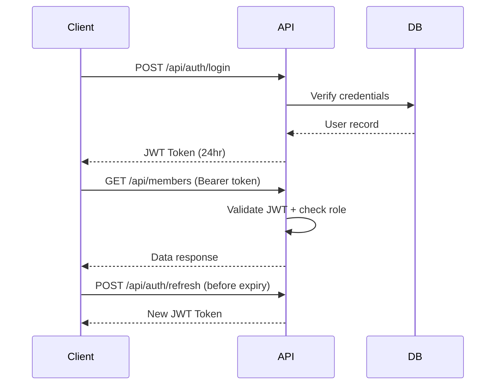

# Authentication API

**Base Path:** `/api/auth`
**Target:** Web applications, mobile apps, enterprise systems

---

## Overview

Stateless JWT-based authentication with token refresh, password management, and multi-factor auth support. Works across desktop, web, and mobile clients.

**Key Features:**
- JWT tokens (HS256, 24-hour expiry)
- Token refresh without re-login
- Password change and reset flows
- Multi-factor authentication (MFA) support
- Session management
- Role embedded in token — no extra DB call needed

---

## Endpoints

### Login
```
POST /api/auth/login
```
No authentication required.

**Request Body:**
```json
{
  "username": "admin",
  "password": "your_password"
}
```

**Response `200`:**
```json
{
  "token": "eyJhbGciOiJIUzI1NiIsInR5cCI6IkpXVCJ9...",
  "user": {
    "id": 1,
    "username": "admin",
    "name": "System Administrator",
    "role": "admin"
  }
}
```

---

### Logout
```
POST /api/auth/logout
```
**Headers:** `Authorization: Bearer <token>`

Client must discard the token locally after this call.

---

### Refresh Token
```
POST /api/auth/refresh
```
**Headers:** `Authorization: Bearer <token>`

Issues a new token before the current one expires.

**Response `200`:**
```json
{
  "token": "eyJhbGciOiJIUzI1NiIsInR5cCI6IkpXVCJ9..."
}
```

---

### Register User
```
POST /api/auth/register
```

**Request Body:**
```json
{
  "username": "new_user",
  "password": "SecurePass123",
  "full_name": "John Kamau",
  "role": "user",
  "email": "john@example.com"
}
```

---

### Change Password
```
POST /api/auth/change-password
```
**Headers:** `Authorization: Bearer <token>`

```json
{
  "old_password": "OldPass123",
  "new_password": "NewSecurePass456"
}
```

---

### Get Current User
```
GET /api/auth/me
```
**Headers:** `Authorization: Bearer <token>`

Returns the profile of the currently authenticated user from the token payload.

---

## Token Structure

```json
{
  "user_id": 1,
  "username": "admin",
  "role": "admin",
  "iat": 1700000000,
  "exp": 1700086400
}
```

---

## Authentication Flow



---

## Use Cases
- Web application login systems
- Mobile app authentication
- Enterprise SSO integration
- API gateway authentication
- Microservices inter-service auth
