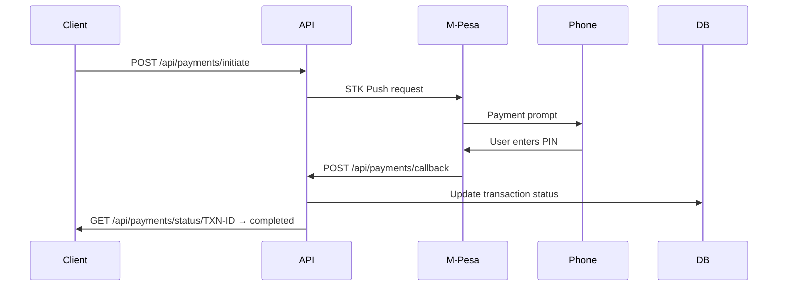

# Payment Processing API

**Base Path:** `/api/payments`
**Target:** E-commerce, subscription services, financial apps

---

## Overview

M-Pesa STK Push integration for initiating and tracking payments, with a callback endpoint for real-time payment confirmation.

**Key Features:**
- M-Pesa STK Push (Lipa Na M-Pesa)
- Transaction status tracking
- Callback webhook for real-time confirmation
- Transaction reference management
- Supports SHA contribution payments, claim co-payments, and registration fees

---

## Endpoints

### Initiate Payment
```
POST /api/payments/initiate
```
**Required Role:** `admin`, `user`

Triggers an M-Pesa STK Push to the customer's phone.

**Request Body:**
```json
{
  "phone": "0712345678",
  "amount": 500,
  "reference": "SHA-CONTRIB-2024-001",
  "description": "SHA Monthly Contribution"
}
```

**Required Fields:** `phone`, `amount`, `reference`, `description`

**Response `200`:**
```json
{
  "success": true,
  "transaction_id": "TXN-20240601-001",
  "status": "pending",
  "message": "STK Push sent to 0712345678"
}
```

---

### Check Payment Status
```
GET /api/payments/status/<transaction_id>
```
**Required Role:** `admin`, `user`

**Response `200`:**
```json
{
  "transaction_id": "TXN-20240601-001",
  "status": "completed",
  "amount": 500,
  "phone": "0712345678",
  "reference": "SHA-CONTRIB-2024-001",
  "completed_at": "2024-06-01T10:05:00Z"
}
```

**Status values:** `pending`, `completed`, `failed`, `cancelled`

---

### Payment Callback
```
POST /api/payments/callback
```
No authentication required — called by M-Pesa servers.

M-Pesa posts payment confirmation here. The system automatically updates transaction status and triggers downstream actions (e.g. activating a member contribution).

---

## Payment Flow



---

## Use Cases
- SHA monthly contribution collection
- Hospital co-payment processing
- Registration fee collection
- Subscription billing
- Fine and penalty payments
