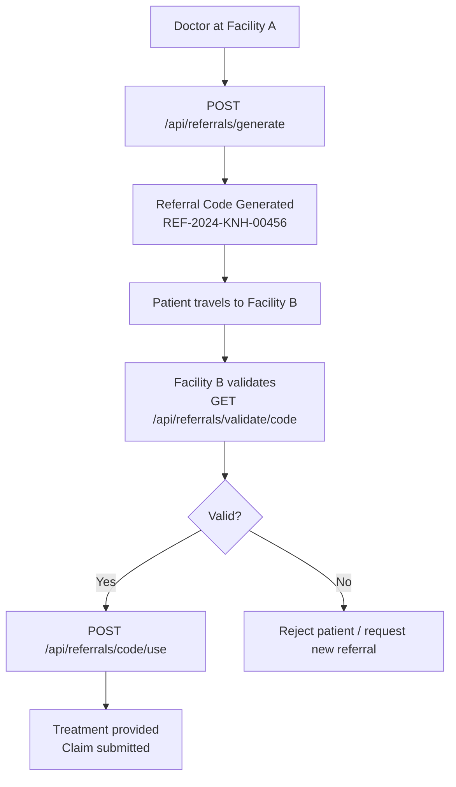

# Referral Management API

**Base Path:** `/api/referrals`
**Target:** Healthcare providers, specialist networks, patient services

---

## Overview

Generates, validates, and tracks patient referrals between healthcare facilities. Prevents referral fraud, ensures continuity of care, and provides a full referral audit trail.

**Key Features:**
- Unique referral code generation
- Referral validation at receiving facility
- Expiry management (referrals expire after set period)
- Referral status tracking (pending, used, expired, cancelled)
- Specialist network routing
- Integration with claims API for referral-based claims

---

## Endpoints

### Generate Referral
```
POST /api/referrals/generate
```
**Required Role:** `admin`, `doctor`, `hospital`

Generates a unique referral code for a patient being referred to another facility or specialist.

**Request Body:**
```json
{
  "member_id": 1,
  "referring_facility_id": 3,
  "receiving_facility_id": 7,
  "specialist_type": "cardiologist",
  "reason": "Chest pain — requires cardiac evaluation",
  "urgency": "urgent",
  "referred_by": 12,
  "valid_days": 14
}
```

**Response `201`:**
```json
{
  "success": true,
  "referral_code": "REF-2024-KNH-00456",
  "member_id": 1,
  "member_name": "Jane Wanjiku",
  "referring_facility": "Kenyatta National Hospital",
  "receiving_facility": "Nairobi Heart Centre",
  "specialist_type": "cardiologist",
  "urgency": "urgent",
  "expires_at": "2024-06-15T00:00:00Z",
  "status": "pending"
}
```

---

### Validate Referral
```
GET /api/referrals/validate/<code>
```
**Required Role:** `admin`, `doctor`, `hospital`

Called by the receiving facility to verify a referral before accepting the patient.

**Example:**
```
GET /api/referrals/validate/REF-2024-KNH-00456
```

**Response `200` — Valid:**
```json
{
  "success": true,
  "valid": true,
  "referral_code": "REF-2024-KNH-00456",
  "member_name": "Jane Wanjiku",
  "member_id": 1,
  "eligible": true,
  "referring_facility": "Kenyatta National Hospital",
  "specialist_type": "cardiologist",
  "urgency": "urgent",
  "expires_at": "2024-06-15T00:00:00Z",
  "status": "pending"
}
```

**Response `200` — Invalid:**
```json
{
  "success": true,
  "valid": false,
  "reason": "Referral has expired"
}
```

---

### Use Referral
```
POST /api/referrals/<code>/use
```
**Required Role:** `admin`, `doctor`, `hospital`

Marks a referral as used when the patient arrives at the receiving facility.

**Request Body:**
```json
{
  "used_by_facility_id": 7,
  "attending_doctor_id": 15,
  "notes": "Patient arrived. Cardiac assessment initiated."
}
```

---

### Get Referral History
```
GET /api/referrals/member/<member_id>
```
**Required Role:** `admin`, `doctor`, `auditor`

Returns all referrals for a specific member.

---

### Referral Statistics
```
GET /api/referrals/stats
```
**Required Role:** `admin`, `auditor`

**Response `200`:**
```json
{
  "total_generated": 1250,
  "pending": 340,
  "used": 820,
  "expired": 75,
  "cancelled": 15,
  "utilization_rate": 65.6
}
```

---

## Referral Status Values

| Status | Meaning |
|--------|---------|
| `pending` | Generated, not yet used |
| `used` | Patient attended receiving facility |
| `expired` | Validity period passed |
| `cancelled` | Cancelled by referring facility |

---

## Referral Workflow



---

## Use Cases
- Hospital-to-specialist referral management
- County hospital to national hospital referrals
- Emergency referral tracking
- Specialist network utilization reporting
- Referral-based claims validation
