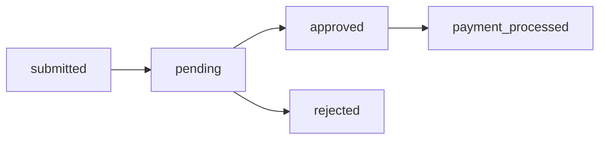

# Claims Management API

**Base Path:** `/api/claims`
**Target:** Insurance companies, healthcare providers, claims processors

---

## Overview

End-to-end claims lifecycle management — from submission to payment. Includes automatic duplicate detection, AI risk scoring, approval workflows, and fraud integration.

**Key Features:**
- Digital claim submission with validation
- Automatic duplicate detection (same member + hospital + day)
- Real-time AI risk scoring on submission
- Approve/reject workflows with audit trail
- Fraud detection integration
- Claims statistics and reporting

---

## Endpoints

### Submit Claim
```
POST /api/claims/submit
```
**Required Role:** `admin`, `hospital`, `claims_officer`

**Request Body:**
```json
{
  "member_id": 1,
  "hospital_id": 3,
  "treatment_type": "Inpatient",
  "claim_amount": 45000,
  "description": "Appendectomy — 3 day admission",
  "admission_date": "2024-05-28",
  "discharge_date": "2024-05-31",
  "diagnosis_code": "K37",
  "referral_code": "REF-2024-KNH-00456"
}
```

**Required Fields:** `member_id`, `hospital_id`, `claim_amount`

**Response `201`:**
```json
{
  "success": true,
  "message": "Claim submitted successfully",
  "claim_id": 56,
  "risk_score": 22,
  "risk_level": "low",
  "is_duplicate": false,
  "status": "pending"
}
```

---

### Get Claims
```
GET /api/claims
```
**Required Role:** `admin`, `claims_officer`, `hospital`

**Query Parameters:** `status`, `member_id`, `hospital_id`, `page`, `per_page`

---

### Get Single Claim
```
GET /api/claims/<id>
```
**Required Role:** `admin`, `claims_officer`, `hospital`

---

### Approve Claim
```
POST /api/claims/<id>/approve
```
**Required Role:** `admin`, `claims_officer`

**Response `200`:**
```json
{
  "success": true,
  "message": "Claim approved",
  "claim_id": 56,
  "approved_at": "2024-06-01T10:00:00Z"
}
```

---

### Reject Claim
```
POST /api/claims/<id>/reject
```
**Required Role:** `admin`, `claims_officer`

**Request Body:**
```json
{
  "reason": "Treatment not covered under current benefit package"
}
```

---

### Claims Statistics
```
GET /api/claims/stats
```
**Required Role:** `admin`, `auditor`

**Response `200`:**
```json
{
  "pending": 45,
  "approved": 320,
  "rejected": 18,
  "total": 383,
  "total_approved_amount": 1850000
}
```

---

## Claims Lifecycle



---

## Risk Score on Submission

| Score | Level | Auto-action |
|-------|-------|-------------|
| 0–20 | Low | Eligible for auto-approval |
| 21–50 | Medium | Manual review queue |
| 51–100 | High | Fraud alert created |

---

## Use Cases
- Hospital claims submission to SHA
- Insurance claim adjudication
- Pre-authorization requests
- Claim status tracking for patients
- Bulk claims processing for large facilities
