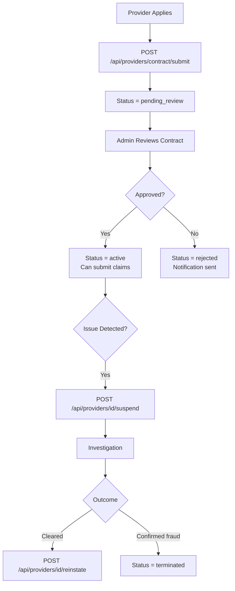

# Provider Management API

**Base Path:** `/api/providers`
**Target:** Healthcare networks, vendor management, service providers

---

## Overview

Manages healthcare provider contracting, compliance status, suspension workflows, and performance monitoring within the SHA network.

**Key Features:**
- Provider contract submission and management
- Status management (active, suspended, terminated)
- Compliance tracking
- Performance metrics per provider
- Suspension with reason and audit trail
- Reinstatement workflow

---

## Endpoints

### Submit Provider Contract
```
POST /api/providers/contract/submit
```
**Required Role:** `admin`

Registers a new provider and submits their contract for review.

**Request Body:**
```json
{
  "provider_name": "Nairobi Heart Centre",
  "facility_code": "NHC-003",
  "provider_type": "specialist_clinic",
  "county": "Nairobi",
  "sub_county": "Westlands",
  "address": "Westlands Road, Nairobi",
  "phone": "0720000333",
  "email": "contracts@nairobiheart.co.ke",
  "contract_start": "2024-07-01",
  "contract_end": "2025-06-30",
  "services_offered": ["cardiology", "echocardiography", "cardiac_surgery"],
  "submitted_by": 1
}
```

**Response `201`:**
```json
{
  "success": true,
  "message": "Provider contract submitted successfully",
  "provider_id": 25,
  "contract_id": "CONTRACT-2024-NHC-003",
  "status": "pending_review"
}
```

---

### Get Provider
```
GET /api/providers/<id>
```
**Required Role:** `admin`, `auditor`

Returns full provider profile including contract details and performance stats.

---

### List Providers
```
GET /api/providers
```
**Required Role:** `admin`, `auditor`

**Query Parameters:** `status`, `county`, `provider_type`, `search`, `page`, `per_page`

---

### Suspend Provider
```
POST /api/providers/<id>/suspend
```
**Required Role:** `admin`

Immediately suspends a provider from submitting claims.

**Request Body:**
```json
{
  "reason": "Fraudulent billing pattern detected — under investigation",
  "suspended_by": 1,
  "suspension_type": "temporary"
}
```

**Suspension types:** `temporary`, `permanent`

**Response `200`:**
```json
{
  "success": true,
  "message": "Provider suspended successfully",
  "provider_id": 25,
  "status": "suspended",
  "suspended_at": "2024-06-01T10:00:00Z"
}
```

---

### Reinstate Provider
```
POST /api/providers/<id>/reinstate
```
**Required Role:** `admin`

**Request Body:**
```json
{
  "reason": "Investigation complete. No fraud confirmed. Provider cleared.",
  "reinstated_by": 1
}
```

---

### Provider Performance Stats
```
GET /api/providers/<id>/stats
```
**Required Role:** `admin`, `auditor`

**Response `200`:**
```json
{
  "provider_id": 25,
  "total_claims": 320,
  "approved": 295,
  "rejected": 25,
  "approval_rate": 92.2,
  "average_claim_amount": 18500,
  "average_risk_score": 14.3,
  "fraud_alerts": 0,
  "contract_status": "active"
}
```

---

## Provider Status Values

| Status | Meaning |
|--------|---------|
| `pending_review` | Contract submitted, awaiting approval |
| `active` | Approved and can submit claims |
| `suspended` | Temporarily blocked |
| `terminated` | Contract ended or permanently removed |

---

## Provider Management Workflow



---

## Use Cases
- SHA provider network management
- Hospital accreditation tracking
- Specialist clinic contracting
- Vendor compliance management
- Provider performance benchmarking
