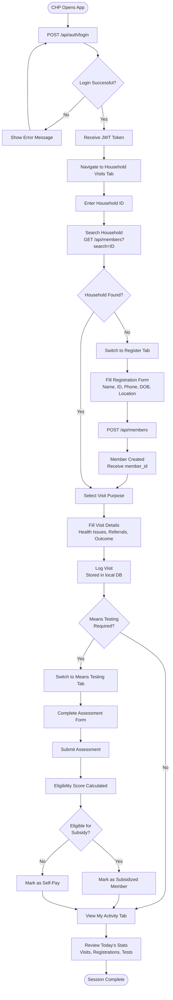

# CHP Registration & Visit Workflow

This document describes the end-to-end workflow for a **Community Health Promoter (CHP)** using the SHA system — from logging in to completing a household visit and registering new members.

---

## Overview

CHPs are the frontline workers of SHA. They visit households in their assigned areas to:
- Register unregistered community members
- Conduct means testing to determine subsidy eligibility
- Log health issues and make referrals
- Report their activity back to SHA

---

## Full CHP Workflow



---

## Step-by-Step API Calls

### Step 1 — Login

```http
POST /api/auth/login
Content-Type: application/json

{
  "username": "chp_nairobi_001",
  "password": "SecurePass123"
}
```

Save the returned `token` for all subsequent requests.

---

### Step 2 — Search for Household

```http
GET /api/members?search=12345678
Authorization: Bearer <token>
```

If the member exists, proceed to log the visit. If not, register them first.

---

### Step 3 — Register New Member (if not found)

```http
POST /api/members
Authorization: Bearer <token>
Content-Type: application/json

{
  "full_name": "Peter Otieno",
  "national_id": "12345678",
  "phone": "0700111222",
  "dob": "1978-11-03",
  "county": "Kisumu",
  "sub_county": "Kisumu Central",
  "ward": "Market Milimani",
  "gender": "male"
}
```

---

### Step 4 — Check Eligibility

```http
GET /api/members/105/eligibility
Authorization: Bearer <token>
```

---

### Step 5 — Run Risk Assessment (if flagged)

```http
POST /api/fraud/risk-assessment
Authorization: Bearer <token>
Content-Type: application/json

{
  "type": "member",
  "id": 105
}
```

---

## CHP Activity Summary

At the end of each day, a CHP's supervisor can pull their activity:

```http
GET /api/members?page=1&per_page=50
Authorization: Bearer <token>
```

Filter by `registration_date` to see today's registrations.

---

## Key Points

- CHPs only need the **Members API** and **Auth API** for their core workflow
- Means testing results are stored locally and synced when connectivity is available
- The system supports **offline-first** operation — data is cached and uploaded when online
- All CHP actions are logged in the audit trail for accountability
