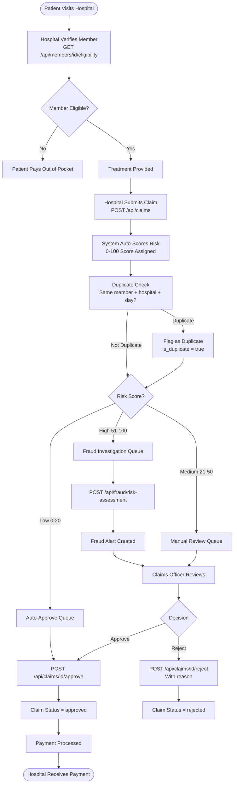

# Claims Processing Workflow

This document describes the full lifecycle of a health insurance claim — from a hospital submitting it to SHA paying out the approved amount.

---

## Overview



---

## Step-by-Step API Calls

### Step 1 — Verify Member at Point of Care

Before treating, the hospital checks if the patient is an active SHA member:

```http
GET /api/members/1/eligibility
Authorization: Bearer <token>
```

**Response:**
```json
{
  "member_id": 1,
  "name": "Jane Wanjiku",
  "eligible": true,
  "status": "active"
}
```

---

### Step 2 — Submit Claim After Treatment

```http
POST /api/claims
Authorization: Bearer <token>
Content-Type: application/json

{
  "member_id": 1,
  "hospital_id": 3,
  "treatment_type": "Inpatient",
  "claim_amount": 45000.00,
  "description": "Appendectomy - 3 day admission"
}
```

**Response:**
```json
{
  "message": "Claim submitted successfully",
  "claim_id": 56,
  "risk_score": 22,
  "is_duplicate": false
}
```

---

### Step 3 — Claims Officer Reviews Pending Claims

```http
GET /api/claims?status=pending
Authorization: Bearer <token>
```

---

### Step 4a — Approve Claim

```http
POST /api/claims/56/approve
Authorization: Bearer <token>
```

---

### Step 4b — Reject Claim

```http
POST /api/claims/56/reject
Authorization: Bearer <token>
Content-Type: application/json

{
  "reason": "Treatment not covered under current benefit package"
}
```

---

### Step 5 — Check High-Risk Claims Dashboard

```http
GET /api/fraud/high-risk-claims?threshold=50
Authorization: Bearer <token>
```

---

### Step 6 — View Claims Statistics

```http
GET /api/claims/stats
Authorization: Bearer <token>
```

**Response:**
```json
{
  "pending": 45,
  "approved": 320,
  "rejected": 18,
  "total": 383,
  "total_approved_amount": 1850000.00
}
```

---

## Claim Lifecycle States

```
submitted → pending → approved → payment_processed
                   ↘ rejected
```

---

## Duplicate Detection Logic

A claim is flagged as duplicate when:
- Same `member_id`
- Same `hospital_id`
- Same `treatment_type`
- Submitted on the **same calendar day**

Duplicate claims are not automatically rejected — they are flagged for manual review so legitimate re-submissions (e.g. corrections) can still be processed.

---

## Key Points

- Risk scoring happens **automatically** at submission — no extra API call needed
- Separate `approve` and `reject` endpoints make the officer workflow clean and explicit
- All decisions are timestamped (`processed_at`) for audit purposes
- The stats endpoint gives real-time totals for management dashboards
