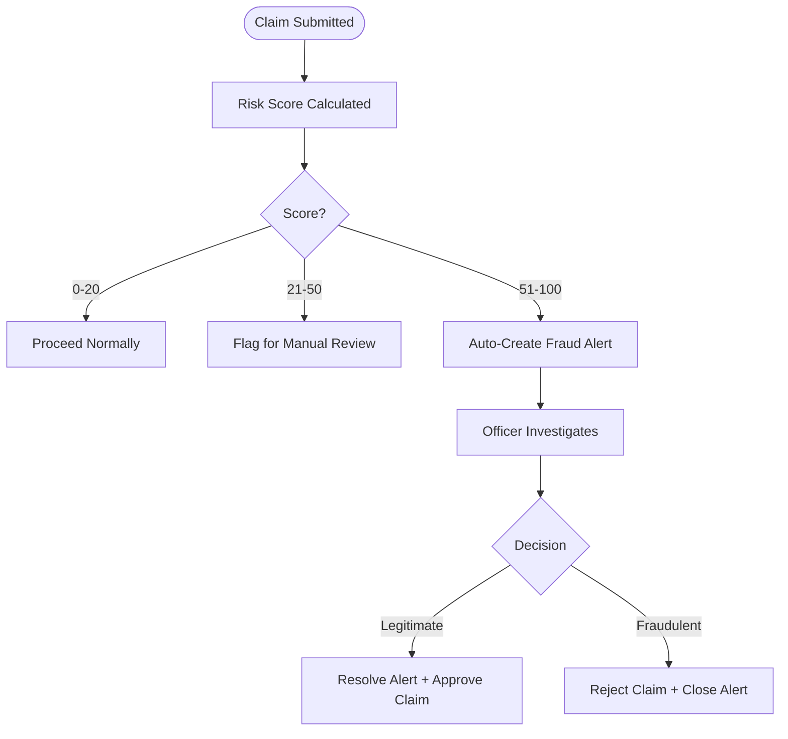

# Fraud Detection Workflow

## How It Works

Every claim gets a risk score (0–100) on submission. Scores above 50 auto-create a fraud alert.



---

## Key API Calls

**View active alerts:**
```http
GET /api/fraud/alerts?status=active&severity=high
Authorization: Bearer <token>
```

**Run manual risk check:**
```http
POST /api/fraud/risk-assessment
Authorization: Bearer <token>

{ "type": "claim", "id": 55 }
```

**Resolve alert:**
```http
POST /api/fraud/alerts/7/resolve
Authorization: Bearer <token>

{ "resolution": "Verified legitimate. Supporting docs confirmed." }
```

**Fraud dashboard stats:**
```http
GET /api/fraud/stats
Authorization: Bearer <token>
```

---

## Common Fraud Patterns Detected

| Pattern | Detection Method |
|---------|-----------------|
| Double billing | Duplicate check on submission |
| Inflated amounts | High risk score alert |
| Ghost patients | Eligibility check before treatment |
| Unverified hospitals | Must be `verified` to submit claims |
